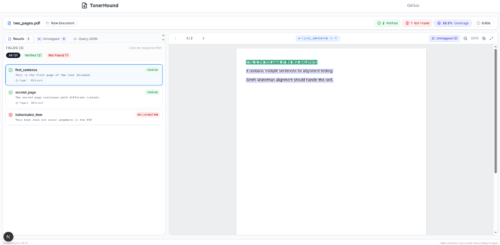

# TonerHound

**Deterministic evidence grounding for LLM document extraction.**

TonerHound resolves extracted values to exact physical PDF coordinates — no coordinate hallucination, no neural networks, no cloud APIs. Given any extracted JSON and its source PDF, it returns the precise bounding box for every value, or tells you the value cannot be grounded.

[](LICENSE)
[](https://www.python.org/downloads/)
[](tests/)
[](docs/benchmark-results.md)

<p align="center">
  
</p>

---

## What It Does

LLMs extract values from documents. They rarely say *where* those values came from. TonerHound closes that gap.

```
Extracted: {"total_revenue": "$8,420.50"}
     ↓ TonerHound
Grounded:  {"total_revenue": {"value": "$8,420.50",
                              "page": 47,
                              "bbox": [0.412, 0.318, 0.089, 0.011],
                              "status": "VERIFIED"}}
```

Every bounding box is deterministic: same input, same output, every time. No sampling, no temperature, no API calls. Runs on a laptop, offline.

---

## Why Deterministic Grounding

| Property | TonerHound | Typical VLM grounding |
|---|---|---|
| Reproducible | ✅ Same output every run | ❌ Varies with sampling |
| Auditable | ✅ Traceable to character offsets | ❌ Black-box neural net |
| Offline | ✅ No network required | ❌ Cloud API |
| Cost | ✅ $0.00 per page | ⚠️ $0.01–$0.40 per page |
| Accuracy (ExtractBench) | 72.62% Word F1 | 82.2% Word F1 (frontier) |

TonerHound trades ~10 points of grounding accuracy for reproducibility, auditability, and zero cost. That trade is worth it when you need to *prove* where a number came from.

---

## Quick Start

### Install

```bash
git clone https://github.com/vanrajsinh650/TonerHound
cd TonerHound
uv sync
```

Requires Python 3.12+ and Tesseract OCR. Install Tesseract via `brew install tesseract` (macOS) or `apt install tesseract-ocr` (Linux).

### Resolve Evidence for Extracted Fields

```python
import tonerhound

results = tonerhound.resolve(
    document="invoice.pdf",
    extraction=[
        {"field": "invoice_number", "value": "INV-2024-0847"},
        {"field": "total", "value": "$8,420.50"},
        {"field": "due_date", "value": "2024-03-15"},
    ],
)

for res in results:
    if res.is_grounded:
        print(f"{res.field}: {res.status.value} → page {res.page}, bbox {res.bbox}")
    else:
        print(f"{res.field}: UNGROUNDED ({res.status.value})")
```

Output:
```
invoice_number: exact → page 1, bbox [0.12, 0.08, 0.21, 0.02]
total:          normalized → page 3, bbox [0.41, 0.32, 0.09, 0.01]
due_date:       exact → page 1, bbox [0.68, 0.08, 0.14, 0.02]
```

If a value cannot be grounded, `res.is_grounded` is `False` with status `not_found` or `ambiguous`, and `res.bbox` is `None`.

### Web UI (Interactive Verification Workbench)

Run the local web interface to inspect evidence grounding and document coverage visually:

```bash
# Terminal 1: Backend API
uv run uvicorn backend.server:app --reload --port 8000

# Terminal 2: Web Interface
cd frontend && npm run dev
```

Open `http://localhost:3000` to upload documents, review bounding boxes, and discover unmapped text.

### Run the benchmark

```bash
python -m tonerhound.benchmark --data-dir research/data/full --exp-id VERIFY
# Expected: Word Grounding F1 = 72.6179%
```

---

## Benchmark Summary

Evaluated on the official ExtractBench 370-document corpus (498,140 fields). Full results in [docs/benchmark-results.md](docs/benchmark-results.md).

| Metric | Score |
|---|---|
| Word Grounding F1 | **72.6179%** |
| Page Grounding F1 | 83.8490% |
| Word Precision | 77.7935% |
| Word Recall | 68.9729% |
| Passing Fields | 327,671 / 498,140 |
| Regressions (across 7 experiments) | **0** |

### ExtractBench Leaderboard (370 Documents)

| Rank | Provider | Word Grounding F1 | Short | Medium | Long | Page Grounding F1 | Cost / Nature |
|:---:|:---|:---:|:---:|:---:|:---:|:---:|:---:|
| 1 | LlamaExtract Agentic Plus | **81.26%** | **81.63%** | 81.18% | 75.22% | 89.94% | Paid ($0.081/page) |
| 2 | LlamaExtract Agentic | 78.89% | 77.63% | **81.86%** | **80.89%** | **90.64%** | Paid ($0.050/page) |
| 3 | Codex (GPT-6 Sol Evidence) | 77.11% | 77.61% | 75.53% | 78.31% | 86.50% | Cloud LLM |
| **4** | **TonerHound** | **72.62%** | **70.72%** | **80.58%** | **68.82%** | **83.85%** | **$0.00 (Zero Neural)** |
| 5 | Claude Code (Opus 5.5 Evidence) | 71.55% | 73.57% | 65.54% | 74.87% | 76.95% | Cloud LLM |
| 6 | Codex (GPT-6 Luna Evidence) | 65.70% | 62.91% | 71.11% | 74.36% | 83.93% | Cloud LLM |
| 7 | Claude Code (Sonnet 5.5 Evidence) | 64.61% | 64.59% | 63.18% | 71.22% | 75.99% | Cloud LLM |
| 8 | Reducto Extract (v4) | 54.97% | 60.53% | 49.35% | 16.30% | 75.28% | Commercial API |
| 9 | Codex (GPT-5.6 Sol Evidence) | 54.66% | 50.87% | 64.58% | 69.01% | 83.62% | Cloud LLM |
| 10 | LlamaExtract Cost-Effective | 53.65% | 49.20% | 64.84% | 55.66% | 80.09% | Cloud LLM |
| 11 | Codex (GPT-5.5 Evidence) | 52.57% | 53.13% | 48.01% | 61.87% | 80.64% | Cloud LLM |

TonerHound places **#4 globally**, outperforming Claude Code (Opus 5.5) and Codex (GPT-6 Luna) purely using classical geometry and Hungarian bipartite matching at zero cost.

**What drove the score (three techniques did ~75% of the work):**
- **Hungarian bipartite table assignment** — globally optimal value-to-cell matching eliminates cascading row-swap errors. +5,845 fields.
- **Date literal variants** — exact matching of 18 canonical date renderings. +3,690 fields.
- **Visual pixel-statistics fallback** — deterministic checkbox detection via morphology and edge density. +1,882 fields.

**What didn't work (and why it matters):** semantic normalization (2/37,850), column rail constraints (0), hyphen joiner v2 (0), Needleman-Wunsch alignment (13). These negative results define the deterministic ceiling. See [docs/how-tonerhound-reached-72.md](docs/how-tonerhound-reached-72.md) for the full research narrative.

---

## Architecture

```
PDF ──► pypdfium2 ──► character stream
          │
          ├──► inverted token index
          ├──► numeric index
          ├──► date index
          └──► OCR noise 3-gram index
          │
Extracted JSON ──► Evidence Resolver
                     │
                     ├── Hungarian table assignment
                     ├── Multi-token sequence matching
                     ├── Visual pixel-statistics fallback
                     ├── Date literal variants
                     └── Multi-region assembly
                     │
                     ▼
             Grounded JSON + bounding boxes
```

**Stack:** `pypdfium2` · `pytesseract` · `numpy` · `scipy` · `OpenCV` · `PyMuPDF` · `rapidfuzz` · `python-dateutil`  
**No PyTorch. No TensorFlow. No models. No training. No GPU.**

---

## Repository Structure

```
TonerHound/
├── src/tonerhound/          # Production code
│   ├── document/            # PDF parsing, indexing, OCR routing
│   ├── resolution/          # Evidence resolver, Hungarian assignment
│   ├── matching/            # Token matching, date variants
│   ├── geometry/            # Bounding box assembly, multi-region
│   └── vision/              # Deterministic checkbox detection
├── tests/                   # 261 unit tests (~20s)
├── benchmarks/              # Official ExtractBench runners
├── research/
│   ├── experiments/         # EXP-001 through EXP-043
│   └── observer/            # Failure Microscope V4
├── docs/
│   ├── benchmark-results.md
│   └── how-tonerhound-reached-72.md
├── pyproject.toml
├── uv.lock
└── LICENSE
```

---

## Contributing

Contributions welcome. Before opening a PR:

```bash
pytest tests/ -v  # 261 tests must pass
python -m tonerhound.benchmark --exp-id YOUR-EXP  # Score must not regress below 72.6179%
```

- Keep it deterministic. No neural networks, no LLMs, no embeddings.
- One experiment per PR. Document the delta in `research/experiments/`.
- Negative results are welcome. They're the most valuable part of the research.

---

## License

MIT License. See [LICENSE](LICENSE) for details.

You can use TonerHound commercially, modify it, redistribute it, or embed it in proprietary software. Attribution is appreciated but not required.

---

## Citation

If you use TonerHound in research, cite:

```bibtex
@software{tonerhound2026,
  title = {TonerHound: Deterministic Evidence Grounding for LLM Document Extraction},
  author = {Vanrajsinh},
  year = {2026},
  url = {https://github.com/vanrajsinh650/TonerHound}
}
```

---

## Acknowledgments

ExtractBench (LlamaIndex) for the benchmark corpus. `pypdfium2` for fast PDF character extraction. Tesseract for the OCR fallback. The `scipy` team for `linear_sum_assignment`.

Built without neural networks, by choice.
