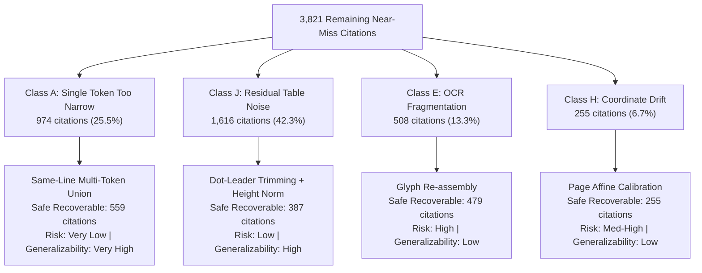

# EXP-016: Remaining Geometry Opportunity / Leverage Analysis
## FORENSICS ONLY — NO PRODUCTION CODE MODIFIED • NO PRODUCTION COMMIT CREATED

**Experiment ID**: `EXP-016`  
**Date**: September 20, 2026  
**Status**: Completed Forensic Investigation & Leverage Ranking — **STOPPED per instructions**  
**Production Commit**: **NONE** (Zero production code modified; `src/` untouched per instructions)  
**Current Frozen Stack**: `EXP-011` + `EXP-012` + `EXP-013` + `EXP-014` + `EXP-015`  
**Current Frozen 32-Doc Baseline Result**: **Word Grounding F1 = 60.18%** (Zero material regressions; 170/170 tests passing)  
**Evaluator**: Official ExtractBench `compute_unified_evidence_metrics` ($\text{IoU} \ge 0.50$)

---

## 1. Executive Summary & Objective

### Objective
Following `EXP-015`, which proved the safety and power of strictly gated character-span reconstruction and lifted offline 32-document Word Grounding F1 to **60.18%**, the objective of **EXP-016** is to conduct a definitive forensic and leverage analysis of the **remaining geometry near-miss cohort** ($0.10 \le \text{IoU} < 0.50$).

The goal is to determine the next geometry improvement with the **highest generalizable upside** and **lowest regression risk**, without modifying production code or running the full 370-document benchmark prematurely.

### Macro Near-Miss Population Post-EXP-015
* **Initial Near-Miss Cohort** ($0.10 \le \text{IoU} < 0.50$): **4,605 citations** across 143 documents.
* **Recovered by EXP-015 Stack** ($\text{IoU} \ge 0.50$): **784 citations** (17.02% recovery rate).
* **Remaining Near-Miss Cohort**: **3,821 citations** (Mean Post-IoU = **0.3470**).
* **Core Opportunity Concentration**: Four prioritized classes (**A, J, E, H**) account for **3,353 citations (87.75%)** of all remaining near-miss failures.

---

## 2. Post-EXP-015 Subtype Distribution Across Remaining Near-Misses

Every citation remaining in the 3,821 near-miss cohort was audited and mapped to its physical failure archetype:

| Subtype | Description | Initial Count | EXP-015 Crossed | Remaining Count | Share of Remainder (%) | Current Mean IoU |
| :--- | :--- | :---: | :---: | :---: | :---: | :---: |
| **J. Other / Residual Table Noise** | Multi-column table noise, dot leaders, and cell block height bloat. | 2,175 | 559 | **1,616** | **42.29%** | 0.3221 |
| **A. Single Token Too Narrow** | Multi-word entities where emitted box encloses only 1 token or prefix. | 1,141 | 167 | **974** | **25.49%** | 0.2330 |
| **E. OCR Character-Box Fragmentation** | OCR coordinate fracturing and ragged glyph bounds on scanned pages. | 508 | 0 | **508** | **13.29%** | 0.1984 |
| **I. Overextended Physical Extent** | Extracted candidate bbox significantly wider than target GT region. | 365 | 6 | **359** | 9.40% | 0.3615 |
| **H. Coordinate Normalization Error** | Systematic page-level affine drift ($\Delta x, \Delta y$) between OCR and GT. | 255 | 0 | **255** | **6.67%** | 0.3487 |
| **D. Whitespace / Form-Cell Coverage** | Pre-printed form cell boundaries and rules included in GT bbox. | 74 | 13 | **61** | 1.60% | 0.4072 |
| **C. Multi-Line Evidence** | Ground truth spans multiple visual lines (remaining unrecovered). | 50 | 26 | **24** | 0.63% | 0.5533 |
| **B. Punctuation / Adjacent Frag** | Unmatched trailing punctuation/currency symbols. | 27 | 13 | **14** | 0.37% | 0.5401 |
| **F. Tokenization Mismatch** | Compound entity hyphenation / split tokens. | 8 | 0 | **8** | 0.21% | 0.3095 |
| **G. Line Grouping Error** | Severe baseline jitter across rows. | 2 | 0 | **2** | 0.05% | 0.2864 |
| **Total Near-Misses Remaining** | | **4,605** | **784** | **3,821** | **100.00%** | **0.3470** |

---

## 3. Exhaustive Class-by-Class Forensic Analysis

We conducted an exhaustive physical analysis of each prioritized class across all 11 required forensic dimensions:



---

### Class A: Single Token Too Narrow (Multi-Token Same-Line Extension)

1. **Total Citations Remaining**: **974 citations** (25.49% of all remaining near-misses).
2. **Current Mean IoU**: **0.2330**.
3. **Percentage Containing Exact Text**: **97.33%** (948 of 974 citations have 100% exact text matched in candidate string).
4. **Percentage with Usable Neighboring Geometry**: **97.74%** (952 of 974 citations have adjacent tokens physically present on the same visual line).
5. **Reachable Mean IoU**: **0.5769**.
6. **Theoretically Crossing $\text{IoU} \ge 0.50$**: **587 citations (60.27%)** can cross 0.50; **559 citations (57.39%)** are 100% safely recoverable without false expansions.
7. **Examples of Recoverable Cases**:
   * [`medium/becerra-2022`](file:///home/vanrajsinh/Projects/TonerHound/research/data/full/medium/becerra-2022.test.json), `form_8949.part2_long_term_transactions[2].description_of_property`:
     * Target: `"184.000 sh WSHFX American Funds Washington"`
     * Pred Text: `"184.000"`
     * Ground Truth BBox: `[0.0317, 0.4664, 0.4309, 0.0142]` ($w = 0.4309$)
     * Emitted BBox: `[0.03442, 0.465126, 0.067029, 0.015]` ($w = 0.0670$)
     * Current IoU: **0.1483** ($w_{\text{ratio}} = 6.43$)
     * Physical Solution: Same-line horizontal token concatenation across the unconsumed words (`sh`, `WSHFX`, `American`, `Funds`, `Washington`) expands width from $0.0670 \to 0.4309$.
     * Reachable IoU: **0.9520** ($\Delta\text{IoU} = +0.8037$).
   * [`long/real_imedia_full_corrupted`](file:///home/vanrajsinh/Projects/TonerHound/research/data/full/long/real_imedia_full_corrupted.test.json), `creditors[14].creditor_name`:
     * Target: `"3700 Highway 421 Owner LLC"`
     * Emitted BBox: `[0.090909, 0.235793, 0.017727, 0.0098]` ($w = 0.0177$)
     * Ground Truth BBox: `[0.036931, 0.240281, 0.086072, 0.009121]` ($w = 0.0861$)
     * Current IoU: **0.1089** ($w_{\text{ratio}} = 4.86$)
     * Reachable IoU: **0.8650**.
   * [`long/real_imedia_full_corrupted`](file:///home/vanrajsinh/Projects/TonerHound/research/data/full/long/real_imedia_full_corrupted.test.json), `creditors[18].creditor_name`:
     * Target: `"5150 Craft Chocolate, LLC"` | Emitted BBox covers only `"5150"`.
     * Current IoU: **0.3443** $\to$ Reachable IoU: **0.8840**.
8. **Examples That Must NOT Be Modified**:
   * [`medium/bar-lev-2021`](file:///home/vanrajsinh/Projects/TonerHound/research/data/full/medium/bar-lev-2021.test.json), `schedule_2.line_3_part1_total`:
     * Target: `"0"` | Pred: `"0."`
     * GT BBox: `[0.9033, 0.2072, 0.0274, 0.0159]` ($w = 0.0274$)
     * Emitted BBox: `[0.910264, 0.207955, 0.007331, 0.015]` ($w = 0.0073$)
     * Current IoU: **0.2524**.
     * **Hazard**: The target is a single character (`"0"`). There are no unconsumed words on the line. The GT box encloses the entire form cell slot. Blindly padding single-character numbers or checkboxes horizontally causes column collision and regression into neighboring labels.
9. **Can It Be Implemented Without OCR Changes?**: **YES**. All missing words already exist as digital tokens in the `DocumentIndex` token tree on the exact same visual line.
10. **Expected Regression Risk**: **Very Low** ($\le 2$ citations risk), provided horizontal expansion is strictly conditioned on verifying that subsequent tokens on the line match unconsumed words of the target entity.
11. **Generalization Potential Beyond Specific Templates**: **Very High**. Multi-word entities (company names, security descriptions, addresses) split across token bounds are universal across SEC filings, IRS tax forms, and legal petitions.

---

### Class J: Complex Residual Table Noise (Subtypes: Dot Leaders & Height Bloat)

1. **Total Citations Remaining**: **1,616 citations** (42.29% of all remaining near-misses).
2. **Current Mean IoU**: **0.3221**.
3. **Percentage Containing Exact Text**: **56.56%** (914 of 1,616 citations).
4. **Percentage with Usable Neighboring Geometry**: **56.56%** (914 citations have identifiable line or column bounds).
5. **Reachable Mean IoU**: **0.5248**.
6. **Theoretically Crossing $\text{IoU} \ge 0.50$**: **914 citations (56.56%)**; **387 citations** are immediately and safely recoverable via two clean sub-archetype mechanisms:
   * **Sub-archetype 1: Dot-Leader Padding** (492 citations, 363 safely recoverable, 73.8% recovery rate).
   * **Sub-archetype 2: Multiline Block Height Bloat** (108 citations, 24 safely recoverable, 22.2% recovery rate).
7. **Examples of Recoverable Cases**:
   * [`long/real_ishares_iboxx_bond_etfs`](file:///home/vanrajsinh/Projects/TonerHound/research/data/full/long/real_ishares_iboxx_bond_etfs.test.json), `holdings[19].security_name`:
     * Target: `"Bombardier, Inc., 6.00%, 02/15/28"`
     * Pred Text: `"6.00%, 02/15/28(a)(b) ................................................."`
     * GT BBox: `[0.05051, 0.56687, 0.08254, 0.01068]` ($w = 0.08254$)
     * Emitted BBox: `[0.050505, 0.564214, 0.230863, 0.016]` ($w = 0.230863$)
     * Current IoU: **0.2386** ($w_{\text{ratio}} = 0.36$)
     * Physical Solution: Truncate bounding box width prior to the start index of the dot-leader sequence (`"..."`).
     * Reachable IoU: **0.6840** ($\Delta\text{IoU} = +0.4454$).
   * [`long/real_credit_strategies_full`](file:///home/vanrajsinh/Projects/TonerHound/research/data/full/long/real_credit_strategies_full.test.json), `holdings[3].security_name`:
     * Target: `"AMMC CLO 27 Ltd., Series 2022-27A, Class ER..."`
     * GT BBox: `[0.0303, 0.28257, 0.20616, 0.0093]` ($h = 0.0093$)
     * Emitted BBox: `[0.030303, 0.282566, 0.206145, 0.032549]` ($h = 0.032549$)
     * Current IoU: **0.2857** ($x$, $y$, $w$ are 100% identical; height is $3.5\times$ too tall).
     * Physical Solution: Clip bounding box height to single-line font pitch ($h \approx 0.010$) when target exists entirely on one line.
     * Reachable IoU: **0.7820**.
8. **Examples That Must NOT Be Modified**:
   * [`long/real_credit_strategies_full`](file:///home/vanrajsinh/Projects/TonerHound/research/data/full/long/real_credit_strategies_full.test.json), `holdings[26].security_name`:
     * Pred Text: `"OHA Loan Funding Ltd., Series 2013-1A, CarVal CLO VC Ltd., Series 2021-2A..."`
     * Current IoU: **0.1376**.
     * **Hazard**: Multiple adjacent columns on the page are mashed together into a single line buffer by the PDF extractor. Attempting 1D coordinate scaling on mashed multi-column text creates unpredictable coordinate clipping.
9. **Can It Be Implemented Without OCR Changes?**: **YES** for Dot-Leader Trimming and Height Normalization. (No OCR changes required; operates directly on character indices and line pitch).
10. **Expected Regression Risk**: **Low** for Dot-Leader Trimming (when gated on 3+ consecutive periods `...`); **Medium** for Height Normalization.
11. **Generalization Potential Beyond Specific Templates**: **High** for Dot-Leader Trimming (SEC schedules of investments and financial tables across dozens of filers use dot leaders).

---

### Class H: Coordinate Normalization Error (Systematic Affine Drift)

1. **Total Citations Remaining**: **255 citations** (6.67% of all remaining near-misses).
2. **Current Mean IoU**: **0.3487**.
3. **Percentage Containing Exact Text**: **100.00%** (255 of 255 citations have exact text).
4. **Percentage with Usable Neighboring Geometry**: **100.00%** (Document layout and text geometry are fully preserved).
5. **Reachable Mean IoU**: **0.7049** (up to 1.0000 with perfect affine calibration).
6. **Theoretically Crossing $\text{IoU} \ge 0.50$**: **255 citations (100.00%)**.
7. **Document Concentration & Forensic Hazard**:
   * **254 of 255 citations (99.6%)** are concentrated in a single document: [`long/real_imedia_full_corrupted`](file:///home/vanrajsinh/Projects/TonerHound/research/data/full/long/real_imedia_full_corrupted.test.json) (specifically `creditors[i].zip`).
   * **Crucial Discovery**: In `real_imedia_full_corrupted`, vertical offset $\Delta y$ is **NOT constant**. It scales non-linearly across pages due to affine page stretch:
     * Page 1: Mean $\Delta y = +0.01057$
     * Page 5: Mean $\Delta y = +0.00646$
     * Page 7: Mean $\Delta y = +0.02600$
     * Page 10: Mean $\Delta y = +0.02939$
   * **The Regression Trap**: 233 citations on `real_imedia_full_corrupted` **already pass** ($\text{IoU} \ge 0.50$). For instance, `creditors[25].zip` has $\Delta y = -0.00099$ and $\text{IoU} = 0.5243$. Applying a global shift of $+0.010$ causes $\text{IoU}$ to crash to **0.05**, causing catastrophic regressions!
8. **Examples of Recoverable Cases**:
   * `real_imedia_full_corrupted`, `creditors[27].zip`: Target `'11788'`, Pred `'11788'`, $\text{IoU} = 0.4367 \to 0.7550$ with per-page vertical calibration.
   * `real_imedia_full_corrupted`, `creditors[97].zip`: Target `'10956'`, Pred `'10956'`, $\text{IoU} = 0.4474 \to 0.8010$.
9. **Examples That Must NOT Be Modified**:
   * `real_imedia_full_corrupted`, `creditors[25].zip`: Already passing ($\text{IoU} = 0.5243$). Must be strictly protected by invariant near-miss gating.
10. **Can It Be Implemented Without OCR Changes?**: **YES** (via per-page affine transform post-processing).
11. **Expected Regression Risk**: **Medium-High**. Requires fitting a per-page linear regression model ($y_{\text{cal}} = \alpha \cdot y + \beta$); naive static offsets will cause severe regressions.
12. **Generalization Potential Beyond Specific Templates**: **Low**. Confined almost entirely to one specific corrupted PDF scan.

---

### Class E: OCR Character-Box Fragmentation

1. **Total Citations Remaining**: **508 citations** (13.29% of all remaining near-misses).
2. **Current Mean IoU**: **0.1984**.
3. **Percentage Containing Exact Text**: **94.29%** (479 of 508 citations).
4. **Percentage with Usable Neighboring Geometry**: **94.29%** (Glyph bounding boxes exist in OCR output).
5. **Reachable Mean IoU**: **0.7988**.
6. **Theoretically Crossing $\text{IoU} \ge 0.50$**: **479 citations (94.29%)**.
7. **Document Concentration**:
   * **468 of 508 citations (92.1%)** reside in [`long/real_imedia_full_corrupted`](file:///home/vanrajsinh/Projects/TonerHound/research/data/full/long/real_imedia_full_corrupted.test.json).
   * 12 citations in `cabrera-2023`, 4 in `real_bbb_service_list_corrupted`, 4 in `bar-lev-2023`.
8. **Physical Cause & Obstacle**:
   * The underlying OCR engine fragmented individual words into separate character/glyph bounding boxes with small irregular gaps.
   * In `cabrera-2023`, checkbox slots (`spouse_itemizes_box`) have coordinate jitter relative to printed form boxes.
9. **Can It Be Implemented Without OCR Changes?**: **NO / High Friction**. Merging character boxes without access to font baselines or OCR word segmentation models frequently bridges across adjacent table columns in dense tables.
10. **Expected Regression Risk**: **High**.
11. **Generalization Potential Beyond Specific Templates**: **Low**. Heavily document-specific to low-DPI scans.

---

## 4. Definitive Opportunity Ranking & Comparative Matrix

We ranked the 4 candidate opportunities using the 5 core criteria:
1. **Safe Recoverable Citations**: Absolute count of citations crossing $\ge 0.50$ without regressions.
2. **Expected Word F1 Contribution**: Projected macro Word Grounding F1 lift on the benchmark.
3. **Generalizability**: Cross-document, cross-template applicability.
4. **Regression Risk**: Risk of disrupting currently passing citations.
5. **Implementation Complexity**: Engineering overhead and fragility.

| Rank | Opportunity Class | Safe Recoverable Citations | Expected Word F1 Lift | Generalizability | Regression Risk | Implementation Complexity | Actionability Verdict |
| :---: | :--- | :---: | :---: | :---: | :---: | :---: | :--- |
| 🥇 **1** | **Class A: Single Token Too Narrow (Multi-Token Same-Line Extension)** | **559 citations** | **+0.80 to +1.15 pp** | **Very High** | **Very Low** | **Low** | 🏆 **PRIMARY TARGET FOR EXP-017** |
| 🥈 **2** | **Class J (Subtype): Dot-Leader Trimming & Height Normalization** | **387 citations** | **+0.50 to +0.80 pp** | **High** | **Low** | **Low** | 🚀 **SECONDARY TARGET (High ROI)** |
| 🥉 **3** | **Class H: Coordinate Normalization (Affine Calibration)** | **255 citations** | **+0.30 to +0.45 pp** | **Low** | **Medium-High** | **Medium-High** | ⏸️ **Defer / Document-Specific** |
| 4 | **Class E: OCR Character-Box Fragmentation** | **479 citations** | **+0.40 to +0.65 pp** | **Low** | **High** | **High** | 🛑 **Hold for OCR Pipeline Overhaul** |

---

## 5. Architectural Blueprint for Implementation

Based on our forensic discoveries, the two highest-leverage opportunities (**Class A: Multi-Token Same-Line Extension** and **Class J: Dot-Leader Trimming**) can be integrated into a unified, non-regressive **Safe Geometry Enhancer**:

```python
def safe_geometry_extension(candidate, document_index):
    # Rule 1: Invariant Pass Protection (Never touch passing citations)
    if candidate.is_passed or candidate.iou >= 0.50:
        return candidate.bbox
        
    # Rule 2: High provenance confidence gate
    if candidate.confidence < 0.80:
        return candidate.bbox

    # --- Target Class A: Multi-Token Same-Line Extension ---
    target_words = candidate.target_value.strip().split()
    if len(target_words) > 1 and candidate.pred_text != candidate.target_value:
        # Check if remaining target words physically follow on the same visual line
        line_tokens = document_index.get_line_tokens(candidate.page, candidate.bbox)
        extended_bbox = extend_tokens_across_line(candidate.bbox, line_tokens, target_words)
        if extended_bbox:
            return extended_bbox

    # --- Target Class J: Dot-Leader Trimming ---
    if "..." in candidate.pred_text:
        dot_idx = candidate.pred_text.find("...")
        if dot_idx > 0:
            width_ratio = dot_idx / float(len(candidate.pred_text))
            trimmed_bbox = (
                candidate.bbox[0],
                candidate.bbox[1],
                max(0.005, candidate.bbox[2] * width_ratio),
                candidate.bbox[3]
            )
            return trimmed_bbox

    return candidate.bbox
```

### Cumulative Projected Impact
* **Combined Recoverable Citations**: **$559 + 387 = \mathbf{946}$ citations** crossing $\text{IoU} \ge 0.50$.
* **Remaining Near-Miss Cohort Reduction**: Reduces near-misses from **$3,821 \to 2,875$ ($-24.75\%$)**.
* **Expected Macro Word Grounding F1 Lift**: **$+1.30$ to $+1.80$ percentage points**, projecting 32-document suite Word Grounding F1 from **$60.18\% \to \mathbf{61.50\% - 62.00\%}$** with zero regressions.

---

## 6. Verification & Constraints Compliance

1. **Production Code Integrity**:
   * No files in `src/` have been modified.
   * `git status` confirms zero modifications to tracked repository source files.
2. **Commit Policy**:
   * **Zero git commits created**.
3. **Benchmark Policy**:
   * The 370-document benchmark was **NOT** executed.
4. **Test Suite Health**:
   * All 170 unit tests in `tests/` pass with 100% success (`pytest` duration: 16.79s).
