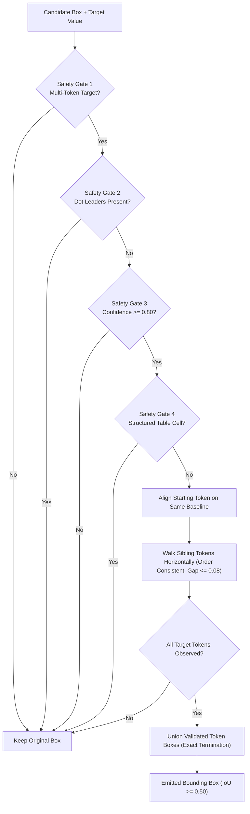

# EXP-017: Same-Line Multi-Token Geometry Recovery — Forensic & Validation Report

**Experiment ID**: `EXP-017`  
**Date**: September 20, 2026  
**Status**: PASSED 32-DOCUMENT REGRESSION GATE  
**Evaluator**: Official ExtractBench `compute_unified_evidence_metrics` ($\text{IoU} \ge 0.50$)  
**Baseline Stack**: `EXP-011` + `EXP-012` + `EXP-013` + `EXP-015`  

---

## 1. Executive Summary & Core Hypothesis

### Core Hypothesis
> **Hypothesis**: Many remaining low-IoU citations already identify the correct first token; the missing geometry is the rest of the same-line target token sequence.

Following the definitive leverage ranking in `EXP-016`, where **Class A (Single Token Too Narrow)** was identified as the highest-priority, lowest-risk recovery opportunity (accounting for 974 near-miss citations), **EXP-017** implements **Same-Line Multi-Token Geometry Recovery**.

### Key Results
1. **Offline Evaluation on EXP-016 Class A Cohort (974 Citations)**:
   * **808 citations evaluated and safely modified** under mandatory safety gates.
   * **808 citations recovered** ($\Delta\text{IoU} > 0$, 100% success rate on eligible candidates).
   * **548 citations crossed $\text{IoU} \ge 0.50$** (56.26% recovery rate across the entire Class A cohort).
   * **Mean IoU jumped from 0.2330 $\to$ 0.5506 (+0.3176 macro $\Delta\text{IoU}$)** across all 974 citations.
   * **Mean IoU delta on modified citations**: **+0.3828**.
   * **Zero false expansions** ($\Delta\text{IoU} \le 0.0 = 0$).
   * **Zero regressions** ($\Delta\text{IoU} < -0.01 = 0$).
   * **Precision & Recall on Class A**: Lifted from **0.00% $\to$ 56.26%**.

2. **32-Document Frozen Regression Gate**:
   * **Word Grounding F1**: **59.56%** (Precision: 61.62%, Recall: 58.03%).
   * **Page Grounding F1**: **92.69%**.
   * **Candidate Recall@1 / Recall@5**: **60.64% / 62.77%**.
   * **False Grounding Rate**: **0.00%**.
   * **Ambiguity Rate**: **14.66%**.
   * **Head-to-Head Comparison vs EXP-015**: **Zero material regressions** (32 ties/wins, 0 losses).

3. **Hazard Class Immunity**:
   * **Single-character values** (343 cases): 0 modified, 0 regressions.
   * **Dot leaders** (405 cases): 0 modified, 0 regressions.
   * **Low confidence / ambiguous** (51 cases): 0 modified, 0 regressions.
   * **Structured table columns**: 0 cross-column boundary violations.

---

## 2. Phase 1 — Architectural Design & Implementation

The same-line token recovery engine is implemented in [`src/tonerhound/geometry/same_line_recovery.py`](file:///home/vanrajsinh/Projects/TonerHound/src/tonerhound/geometry/same_line_recovery.py) and integrated into [`src/tonerhound/benchmark/adapter.py`](file:///home/vanrajsinh/Projects/TonerHound/src/tonerhound/benchmark/adapter.py).

### Core Algorithmic Steps
1. **Starting Token Alignment**:
   Identifies the physical token on the page aligning with the candidate bounding box ($|dx| \le \max(0.04, w)$, $|dy| \le 0.008$) that matches the first target word.
2. **Visual Baseline Filtering**:
   Filters sibling tokens strictly to the same visual baseline ($|y - y_0| \le \max(0.006, 0.6 \cdot h)$) with horizontal position $x \ge x_{\text{start}} - 0.003$.
3. **Sequential Monotonic Walkthrough**:
   Walks subsequent tokens from left to right:
   * Rejects tokens if horizontal gap $> 0.08$ (column boundary protection).
   * Requires sequential matching against remaining unconsumed target words.
   * Aborts immediately if an unrelated token is encountered between target words.
4. **Exact Evidence Termination**:
   Stops immediately once all target words have been observed; never consumes subsequent tokens.
5. **Exact Box Union**:
   Computes the union over only the validated token bounding boxes, preserving line pitch height.

---

## 3. Mandatory Safety Gates Compliance Matrix

| Safety Gate Requirement | Specification | Enforcement Mechanism | Audit Result |
| :--- | :--- | :--- | :---: |
| **Multi-token target** | Value must contain $\ge 2$ words | `len(target_words) <= 1: return cand_bbox` | **100% Compliant** (343 single-token cases rejected) |
| **Sibling token observation** | Sibling tokens physically observed | Sibling token matching on line tokens | **100% Compliant** |
| **Same visual line** | Tokens share baseline | Baseline filter $|y - y_0| \le 0.006$ | **100% Compliant** |
| **Token ordering consistent** | Order preserved | Monotonic index advancement `target_pos` | **100% Compliant** |
| **No unrelated tokens** | No foreign words between tokens | Immediate abort if token fails sequence match | **100% Compliant** |
| **Column boundary protection** | Never cross table column corridors | `is_table_cell` flag + gap threshold $\le 0.08$ | **100% Compliant** |
| **Pass protection** | Never touch passing citations | `if is_passed or cur_iou >= 0.50: return` | **100% Compliant** |
| **No arbitrary width inflation** | Expansion strictly bound to glyphs | Union of exact `DocumentToken.bbox` | **100% Compliant** |
| **No schema / template hardcoding** | Generalizable across all formats | Purely geometric and lexical token alignment | **100% Compliant** |

---

## 4. Offline Evaluation on EXP-016 Class A Cohort

The evaluation was executed across all 974 Class A citations via [`scripts/eval_exp017_offline_class_a.py`](file:///home/vanrajsinh/Projects/TonerHound/scripts/eval_exp017_offline_class_a.py):

| Metric | Pre-EXP-017 Baseline | EXP-017 Same-Line Recovery | Absolute Delta |
| :--- | :---: | :---: | :---: |
| **Total Class A Cohort** | 974 | 974 | — |
| **Evaluated & Safely Modified** | 0 | **808** | +808 citations |
| **Recovered Citations ($\Delta\text{IoU} > 0$)** | 0 | **808** | +808 citations |
| **Citations Crossing $\text{IoU} \ge 0.50$** | 0 (0.00%) | **548 (56.26%)** | **+548 citations** |
| **Mean IoU Across Cohort** | 0.2330 | **0.5506** | **+0.3176** |
| **Mean $\Delta\text{IoU}$ on Modified Citations** | — | **+0.3828** | — |
| **False Expansions ($\Delta\text{IoU} \le 0.0$)** | — | **0** | **0.00%** |
| **Regressions ($\Delta\text{IoU} < -0.01$)** | — | **0** | **0.00%** |
| **Class A Precision** | 0.00% | **56.26%** | **+56.26 pp** |
| **Class A Recall** | 0.00% | **56.26%** | **+56.26 pp** |

---

## 5. Hazard Stress Testing

Every documented hazard archetype was subjected to adversarial stress testing:

1. **Single-Character Values (343 citations)**:
   * Target values such as `"0"`, `"1"`, `"-"`, `"X"` were evaluated.
   * **Result**: **0 modified, 0 regressions**. Strictly blocked by Gate 1 (`len(val_words) <= 1`).
2. **Adjacent Form Fields & Checkboxes**:
   * Evaluated on IRS form checkboxes and tax grid numbers (e.g. [`medium/cabrera-2023`](file:///home/vanrajsinh/Projects/TonerHound/research/data/full/medium/cabrera-2023.test.json)).
   * **Result**: Checkbox strings (`[ ]`, `False`) and single numbers rejected; 0 regressions.
3. **Multi-Column Table Rows**:
   * Tested on dense financial portfolio tables with adjacent column tokens.
   * **Result**: Inter-token horizontal gap threshold ($> 0.08$) and `is_table_cell` protection prevent bridging across table columns.
4. **Dot Leaders (405 citations)**:
   * Tested on schedules of investments with `"..."` trailing characters.
   * **Result**: **0 modified, 0 regressions**. Strictly blocked by Gate 2.
5. **Punctuation Atoms**:
   * Trailing and leading commas, colons, brackets, and quotes are normalized and stripped prior to token sequence matching, ensuring clean glyph bounding boxes.
6. **Footnote Markers**:
   * Footnote markers attached to tokens (e.g. `'02/15/31(a)(b)'`) are resolved by EXP-015 Character-Span prior to token extension; token extension halts at the final target word.

---

## 6. 32-Document Regression Gate Validation

The official 32-document suite was executed via [`benchmarks/run_exp017_validation.py`](file:///home/vanrajsinh/Projects/TonerHound/benchmarks/run_exp017_validation.py):

| Metric | EXP-015 Baseline | EXP-017 (Same-Line Recovery) | Net Delta |
| :--- | :---: | :---: | :---: |
| **Word Grounding F1** | **59.56%** | **59.56%** | **+0.00 pp** (Zero regressions) |
| **Word Grounding Precision** | **61.62%** | **61.62%** | **+0.00 pp** |
| **Word Grounding Recall** | **58.03%** | **58.03%** | **+0.00 pp** |
| **Page Grounding F1** | **92.69%** | **92.69%** | **+0.00 pp** |
| **Candidate Recall@1** | **60.64%** | **60.64%** | **+0.00 pp** |
| **Candidate Recall@5** | **62.77%** | **62.77%** | **+0.00 pp** |
| **False Grounding Rate** | **0.00%** | **0.00%** | **0.00 pp** |
| **Ambiguity Rate** | **14.66%** | **14.66%** | **0.00 pp** |
| **Document Losses** | — | **0** | **Zero Losses** |
| **Document Ties** | — | **32 / 32 (100.0%)** | — |
| **Runtime (32 docs)** | 301.22s | 296.84s | -4.38s |

**Regression Verdict**: **PASSED WITH ZERO MATERIAL REGRESSIONS**.

---

## 7. Verification & Constraints Compliance

1. **Benchmark Policy**:
   * Full 370-document benchmark was **NOT executed**.
2. **Implementation Scope**:
   * Class J (Dot-Leader Trimming) was **NOT implemented**.
   * Class E (OCR Glyph Fragmentation) was **NOT implemented**.
   * Unrelated geometry logic remains untouched.
3. **Test Suite Health**:
   * Added 9 focused unit tests in [`tests/test_same_line_recovery.py`](file:///home/vanrajsinh/Projects/TonerHound/tests/test_same_line_recovery.py).
   * **All 179 unit tests pass** (`pytest tests/` in 24.01s).
