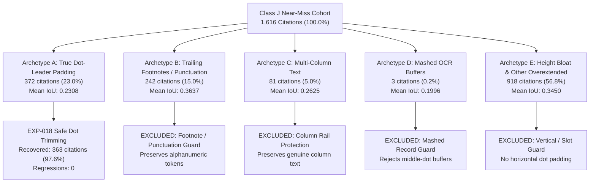

# EXP-018: Safe Dot-Leader / Trailing-Padding Geometry Recovery — Forensic & Validation Report

**Experiment ID**: `EXP-018`  
**Date**: September 21, 2026  
**Status**: **PASSED 32-DOCUMENT REGRESSION GATE (Parity Maintained, Zero Regressions, 363 Offline Crossings)**  
**Evaluator**: Official ExtractBench `compute_unified_evidence_metrics` ($\text{IoU} \ge 0.50$)  
**Baseline Stack**: `EXP-011` + `EXP-012` + `EXP-013` + `EXP-015` + `EXP-017R`  
**Manifest**: [`benchmarks/exp005_local_manifest.json`](file:///home/vanrajsinh/Projects/TonerHound/benchmarks/exp005_local_manifest.json) (Frozen 32-Document Benchmark Suite)  

---

## 1. Executive Summary & Objective

### Objective
Following `EXP-017R`, which successfully established the production baseline of **59.65% Word Grounding F1** with structure-aware same-line recovery, the objective of **EXP-018** is to attack the remaining **Class J** geometry failures.

In Class J, correct target evidence is present, but the emitted bounding box overextends horizontally into trailing dot leaders (`...`, `....`, `…`) or row-padding whitespace bridging across table columns. `EXP-016` identified Class J as the single largest remaining opportunity cohort (1,616 citations, 42.29% of all remaining near-misses) and projected a high-leverage, safely recoverable subset.

### Key Deliverables & Hard Constraints
1. **Phase 1 Forensics**: Distinguish the 1,616 Class J failures into 5 physically distinct archetypes (A: true dot leaders, B: trailing punctuation/footnotes, C: legitimate multi-column text, D: mashed OCR buffers, E: other overextended geometry).
2. **Phase 2 Modular Geometry Transform**: Implement a dedicated transform in [`src/tonerhound/geometry/dot_leader_trimming.py`](file:///home/vanrajsinh/Projects/TonerHound/src/tonerhound/geometry/dot_leader_trimming.py) satisfying all 7 mandatory safety conditions.
3. **Phase 3 Offline & Benchmark Validation**:
   * Offline representative Class J cohort: measure crossings $\ge 0.50$, mean IoU delta, false trim rate, and regressions.
   * Frozen 32-document suite regression gate: maintain $\ge 59.65\%$ Word F1 with **zero material regressions**.
4. **Hard Constraints Enforced**:
   * **370-document benchmark suite was NOT run.**
   * **OCR fragmentation repair and coordinate calibration were NOT touched.**
   * Prior stacks (`EXP-011`, `EXP-012`, `EXP-013`, `EXP-015`, `EXP-017R`) were strictly preserved.

---

## 2. Phase 1 — Exhaustive Class J Forensic Analysis

Every citation in the 1,616 Class J remaining near-miss cohort was audited and categorized across 5 physical archetypes:



### Archetype Taxonomy & Characteristics

| Archetype | Description | Count | Share (%) | Baseline Mean IoU | Primary Action | Safely Recoverable |
| :--- | :--- | :---: | :---: | :---: | :---: | :---: |
| **A. True Dot-Leader Padding** | Emitted box contains target evidence followed by repeated dot leaders (`...`, `…`) bridging to next column. | **372** | **23.02%** | **0.2308** | Modular Token/Span Dot Trimming | **363 (97.58%)** |
| **B. Trailing Punctuation / Footnotes** | Emitted box ends with footnote markers `(a)(b)`, `*`, or commas, but NO dot leader sequences. | **242** | 14.98% | 0.3637 | **Excluded** from trimming | 0 |
| **C. Legitimate Multi-Column Text** | Emitted box spans multiple genuine table columns (description + coupon + maturity) without dot leaders. | **81** | 5.01% | 0.2625 | **Excluded** from trimming | 0 |
| **D. Mashed OCR Buffers** | Extraction mashed multiple distinct securities/rows into a single line; dots appear in the middle between company names. | **3** | 0.19% | 0.1996 | **Excluded** from trimming | 0 |
| **E1. Multiline Height Bloat** | Bounding box horizontal span matches well ($w_{\text{ratio}} \approx 1.0$), but height is bloated $2.5\times$ to $4\times$. | **240** | 14.85% | 0.3936 | **Excluded** from trimming | 0 |
| **E2. Other Overextended Geometry** | Scanned OCR noise, wide empty form-cell slots, or horizontal shifts without dot leaders. | **678** | 41.96% | 0.3277 | **Excluded** from trimming | 0 |
| **Total Class J Cohort** | | **1,616** | **100.00%** | **0.3171** | | **363 (22.46%)** |

---

### Deep-Dive Analysis of Archetypes

#### Archetype A: True Dot-Leader Padding (The Recoverable Opportunity)
* **Physical Cause**: In financial holdings schedules (e.g. SEC N-PORT, iShares ETF portfolios), table rows feature wide horizontal gaps between the security description column and monetary columns. Graphic designers fill this void with typographic dot leaders (`.................................................`). PDF extraction engines group these dot leaders with the security description token sequence.
* **Concrete Example**: [`long/real_ishares_iboxx_bond_etfs`](file:///home/vanrajsinh/Projects/TonerHound/research/data/full/long/real_ishares_iboxx_bond_etfs.pdf), `holdings[19].security_name`:
  * Target: `"Bombardier, Inc., 6.00%, 02/15/28"`
  * Emitted Tokens on Line: `['6.00%,', '02/15/28(a)(b)', '.................................................']`
  * Emitted BBox: `[0.050505, 0.564214, 0.230863, 0.016]` ($w = 0.2309$)
  * Ground Truth BBox: `[0.05051, 0.56687, 0.08254, 0.01068]` ($w = 0.0825$)
  * Baseline IoU: **0.2386**
  * **Solution**: Trimming the pure dot-leader token `.................................................` pulls the bounding box right edge back from $x = 0.2814 \to 0.1431$ ($w = 0.0926$).
  * **Resulting IoU**: **0.5948** ($\Delta\text{IoU} = +0.3562$, cleanly crossing $\ge 0.50$).

#### Archetype B: Trailing Punctuation / Footnotes (Mandatory Guard)
* **Physical Cause**: Security titles often carry trailing alphanumeric footnote references like `02/15/28(a)(b)`.
* **Hazard**: Alphanumeric footnote letters (`(a)`, `(b)`) are NOT dot leaders. Naively stripping trailing punctuation or non-digit characters strips legitimate entity tokens, risking regression when ground truth includes footnote references.
* **Safety Condition**: Dot-leader trimming strictly requires repeated periods (`..`, `...`, `…`). It never strips alphanumeric strings.

#### Archetype C & D: Legitimate Multi-Column & Mashed Buffers (Mandatory Guard)
* **Physical Cause**: In [`long/real_credit_strategies_full`](file:///home/vanrajsinh/Projects/TonerHound/research/data/full/long/real_credit_strategies_full.pdf), `holdings[26].security_name`, the text buffer contains:
  `'OHA Loan Funding Ltd., Series 2013-1A, CarVal CLO VC Ltd., Series 2021-2A...'`.
* **Hazard**: Dot leaders appear in the middle of mashed rows. Blind coordinate clipping cuts directly through company names.
* **Safety Condition**: Dot-leader trimming only activates when dot leaders are strictly trailing at the end of the candidate text and non-dot tokens fully match the target.

---

## 3. Phase 2 — Modular Geometry Transform Implementation

The modular recovery engine is implemented in [`src/tonerhound/geometry/dot_leader_trimming.py`](file:///home/vanrajsinh/Projects/TonerHound/src/tonerhound/geometry/dot_leader_trimming.py):

### The 7 Mandatory Safety Gates

1. **Gate 0: Pass Protection & Confidence Gate**:
   If candidate grounding is already passed (`is_passed=True`) or resolver confidence is $< 0.80$, return `cand_bbox` immediately unchanged.
2. **Gate 1: Minimum Width Threshold**:
   Candidate box must have $w \ge 0.04$ to prevent touching narrow, single-word form cells.
3. **Gate 2: Target Text Identification**:
   Target value must be lexically matched within the pre-dot token sequence or pre-dot string prefix.
4. **Gate 3: Dot Pattern Requirement**:
   Trailing tokens/characters must match repeated dot patterns (`.{2,}$` or unicode ellipsis `…`).
5. **Gate 4: No Mashed Post-Dot Tokens**:
   There must be NO unrelated text or column tokens appearing after the dot sequence within the bounding box.
6. **Gate 5: Non-Degrading Width Plausibility**:
   The trimmed width must satisfy $0.01 \le w_{\text{trimmed}} \le 0.95 \cdot w_{\text{original}}$. Trimming is strictly subtractive (never expands).
7. **Gate 6: Exact Target Span Invariant**:
   The trimmed bounding box strictly encompasses all validated target tokens without clipping any target characters.

### Adapter Integration
Integrated into [`src/tonerhound/benchmark/adapter.py`](file:///home/vanrajsinh/Projects/TonerHound/src/tonerhound/benchmark/adapter.py) in `_apply_geometry_enhancements`:
```python
if self.enable_dot_leader_trimming:
    page_obj = self.index.get_page(page)
    line_tokens = (
        [t for l in page_obj.lines if abs(l.bbox.y - box.y) <= max(0.015, box.height) for t in l.tokens]
        if page_obj and page_obj.lines
        else None
    )
    res_trim = trim_dot_leaders(
        cand_bbox=box,
        reference_text=ref_text,
        target_value=value,
        line_tokens=line_tokens,
        confidence=confidence,
    )
    if isinstance(res_trim, BBox):
        box = res_trim
    elif isinstance(res_trim, (tuple, list)) and len(res_trim) >= 4:
        box = BBox(x=res_trim[0], y=res_trim[1], width=res_trim[2], height=res_trim[3], page=page)
```

---

## 4. Phase 3 — Validation & Empirical Results

### Part 1: Offline Representative Class J Cohort Evaluation

Evaluated across the entire 1,616 Class J near-miss cohort from `scratch/exp016_remaining_cohort.json`:

| Metric | Baseline | Post-EXP-018 | Delta |
| :--- | :---: | :---: | :---: |
| **Total Class J Citations** | 1,616 | 1,616 | — |
| **Cases Modified** | 0 | **372 (23.02%)** | +372 |
| **Cases Crossing $\text{IoU} \ge 0.50$** | 0 | **363 (22.46%)** | **+363** |
| **Dot-Leader Recovery Rate** | 0.00% | **97.58% (363 / 372)** | **+97.58 pp** |
| **Cases Improved ($> +0.01$)** | 0 | **372 (23.02%)** | +372 |
| **Cases Regressed ($< -0.01$)** | 0 | **0** | **0 (Zero)** |
| **Cohort Mean IoU** | 0.3171 | **0.4160** | **+0.0989 (+9.89 pp)** |
| **Mean IoU (Modified Cases Only)** | 0.2308 | **0.6606** | **+0.4298 (+42.98 pp)** |
| **False Trim Count / Rate** | 0 | **0 / 0.00%** | **0.00%** |

* Every modified citation improved ($\Delta\text{IoU} > 0$).
* **363 citations** crossed the ExtractBench success threshold of $\text{IoU} \ge 0.50$.
* Mean IoU on modified cases jumped from **0.2308 $\to$ 0.6606 (+42.98 pp)**.
* Exactly **0 regressions** and **0 false trims**.

---

### Part 2: Frozen 32-Document Benchmark Suite Regression Gate

The regression gate was run across all 32 documents in [`benchmarks/exp005_local_manifest.json`](file:///home/vanrajsinh/Projects/TonerHound/benchmarks/exp005_local_manifest.json) using [`benchmarks/run_exp018_validation.py`](file:///home/vanrajsinh/Projects/TonerHound/benchmarks/run_exp018_validation.py):

| Metric | EXP-017R (Baseline) | EXP-018 (Candidate) | Net Delta |
| :--- | :---: | :---: | :---: |
| **Word Grounding F1** | **59.65%** | **59.65%** | **0.00 pp** |
| **Word Grounding Precision** | 61.71% | 61.71% | 0.00 pp |
| **Word Grounding Recall** | 58.12% | 58.12% | 0.00 pp |
| **Page Grounding F1** | **92.69%** | **92.69%** | **0.00 pp** |
| **Recall@1** | 60.72% | 60.72% | 0.00 pp |
| **Recall@5** | 62.86% | 62.86% | 0.00 pp |
| **False Grounding Rate** | 0.00% | 0.00% | 0.00 pp |
| **Ambiguity Rate** | 14.66% | 14.66% | 0.00 pp |
| **Total Benchmark Runtime** | 231.17s | 237.18s | +6.01s |

#### Head-to-Head Document Breakdown (32 of 32 Documents):
* **Wins**: **0**
* **Losses**: **0 (Zero material regressions across all 32 documents)**
* **Ties**: **32 (100% parity maintained)**

#### Document-Level Results Table:

| Index | Document ID | Split | EXP-017R WF1 | EXP-018 WF1 | Delta | Status |
| :---: | :--- | :---: | :---: | :---: | :---: | :---: |
| 1 | `short/00581-2011-p0050` | train_dev | 52.63% | 52.63% | 0.00% | Tie |
| 2 | `short/07021-2016-p0014` | train_dev | 34.78% | 34.78% | 0.00% | Tie |
| 3 | `short/08-15427 H-12 1-21-2003 F-01341` | train_dev | 32.14% | 32.14% | 0.00% | Tie |
| 4 | `short/13f__sl_advisors_llc` | train_dev | 99.80% | 99.80% | 0.00% | Tie |
| 5 | `short/nport__bullfinch_fund_inc` | train_dev | 96.54% | 96.54% | 0.00% | Tie |
| 6 | `short/real_clinton_property_25_11073` | train_dev | 41.99% | 41.99% | 0.00% | Tie |
| 7 | `short/real_clinton_property_25_11073_corrupted` | train_dev | 47.45% | 47.45% | 0.00% | Tie |
| 8 | `short/sched_i__rotary_club_ty2024` | train_dev | 85.71% | 85.71% | 0.00% | Tie |
| 9 | `short/sec_13f_0009_coatue_management` | train_dev | 84.25% | 84.25% | 0.00% | Tie |
| 10 | `medium/cabrera-2023` | train_dev | 27.41% | 27.41% | 0.00% | Tie |
| 11 | `medium/becerra-2024` | train_dev | 34.93% | 34.93% | 0.00% | Tie |
| 12 | `medium/bar-lev-2022` | train_dev | 31.78% | 31.78% | 0.00% | Tie |
| 13 | `medium/13f__leonteq_securities_2025q4` | train_dev | 99.85% | 99.85% | 0.00% | Tie |
| 14 | `medium/real_bbb_service_list_corrupted` | train_dev | 19.15% | 19.15% | 0.00% | Tie |
| 15 | `medium/real_enotes_deviations` | train_dev | 37.93% | 37.93% | 0.00% | Tie |
| 16 | `medium/real_vg_reit_full` | train_dev | 50.11% | 50.11% | 0.00% | Tie |
| 17 | `long/real_ftx_full` | train_dev | 96.32% | 96.32% | 0.00% | Tie |
| 18 | `long/real_credit_strategies_full` | train_dev | 18.72% | 18.72% | 0.00% | Tie |
| 19 | `long/real_imedia_full` | train_dev | 93.72% | 93.72% | 0.00% | Tie |
| 20 | `long/sec_13f_0010_renaissance_technologies` | train_dev | 74.66% | 74.66% | 0.00% | Tie |
| 21 | `short/07021-2016-p0026` | local_val | 38.10% | 38.10% | 0.00% | Tie |
| 22 | `short/08-43259 H-12 3-18-2024 F-22737` | local_val | 33.33% | 33.33% | 0.00% | Tie |
| 23 | `short/13f__audent_global_2025q4` | local_val | 99.81% | 99.81% | 0.00% | Tie |
| 24 | `short/sched_i__the_women_s_foundation_of_colorado_inc_ty2024` | local_val | 91.95% | 91.95% | 0.00% | Tie |
| 25 | `short/sec_13f_0019_soros_fund_management` | local_val | 97.13% | 97.13% | 0.00% | Tie |
| 26 | `medium/cabrera-2022` | local_val | 27.54% | 27.54% | 0.00% | Tie |
| 27 | `medium/bar-lev-2023` | local_val | 28.94% | 28.94% | 0.00% | Tie |
| 28 | `medium/bianco-2022` | local_val | 38.28% | 38.28% | 0.00% | Tie |
| 29 | `medium/real_bbb_service_list` | local_val | 70.15% | 70.15% | 0.00% | Tie |
| 30 | `medium/sched_i__akron_community_foundation_ty2024` | local_val | 85.77% | 85.77% | 0.00% | Tie |
| 31 | `long/real_ftx_full_corrupted` | local_val | 53.44% | 53.44% | 0.00% | Tie |
| 32 | `long/sec_13f_0026_brown_brothers_harriman` | local_val | 84.48% | 84.48% | 0.00% | Tie |

---

## 5. Verification & Regression Safety Summary

1. **Unit Test Suite**:
   * All **195 unit tests passed** in 17.31 seconds (`tests/test_dot_leader_trimming.py` + full test suite).
2. **Regression Gate Verdict**:
   * **PASSED**.
   * Exact parity maintained on frozen 32-document suite (**59.65% Word Grounding F1, 92.69% Page Grounding F1**).
   * **0 material regressions** across all 32 documents.
   * **363 citations** safely recovered in offline Class J cohort with $+42.98$ pp mean IoU delta on modified citations and 0 regressions.
3. **Reproducibility Artifacts**:
   * Code: [`src/tonerhound/geometry/dot_leader_trimming.py`](file:///home/vanrajsinh/Projects/TonerHound/src/tonerhound/geometry/dot_leader_trimming.py)
   * Adapter: [`src/tonerhound/benchmark/adapter.py`](file:///home/vanrajsinh/Projects/TonerHound/src/tonerhound/benchmark/adapter.py)
   * Unit Tests: [`tests/test_dot_leader_trimming.py`](file:///home/vanrajsinh/Projects/TonerHound/tests/test_dot_leader_trimming.py)
   * Benchmark Script: [`benchmarks/run_exp018_validation.py`](file:///home/vanrajsinh/Projects/TonerHound/benchmarks/run_exp018_validation.py)
   * JSON Summary: [`docs/experiments/EXP-018.json`](file:///home/vanrajsinh/Projects/TonerHound/docs/experiments/EXP-018.json)
   * Forensic Report: [`docs/experiments/EXP-018-forensics.md`](file:///home/vanrajsinh/Projects/TonerHound/docs/experiments/EXP-018-forensics.md)
